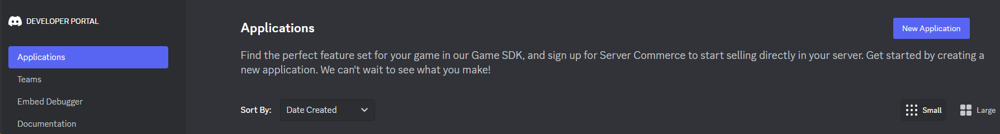
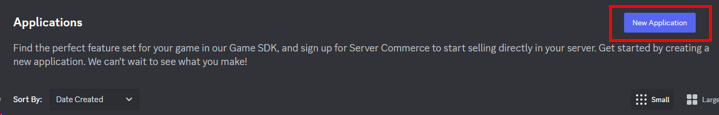
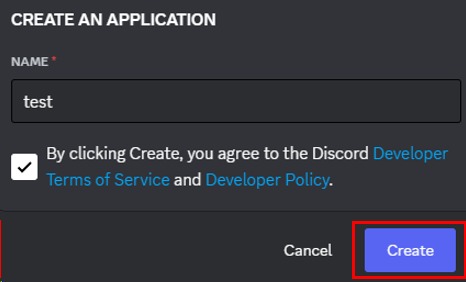
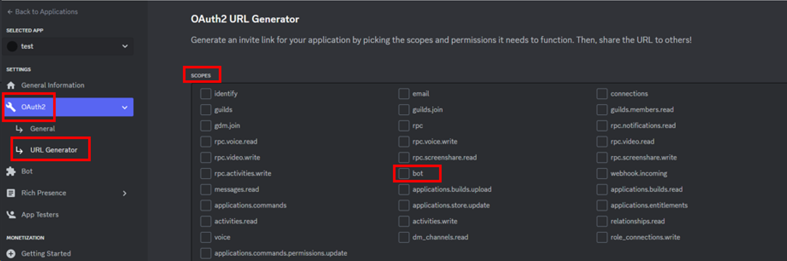
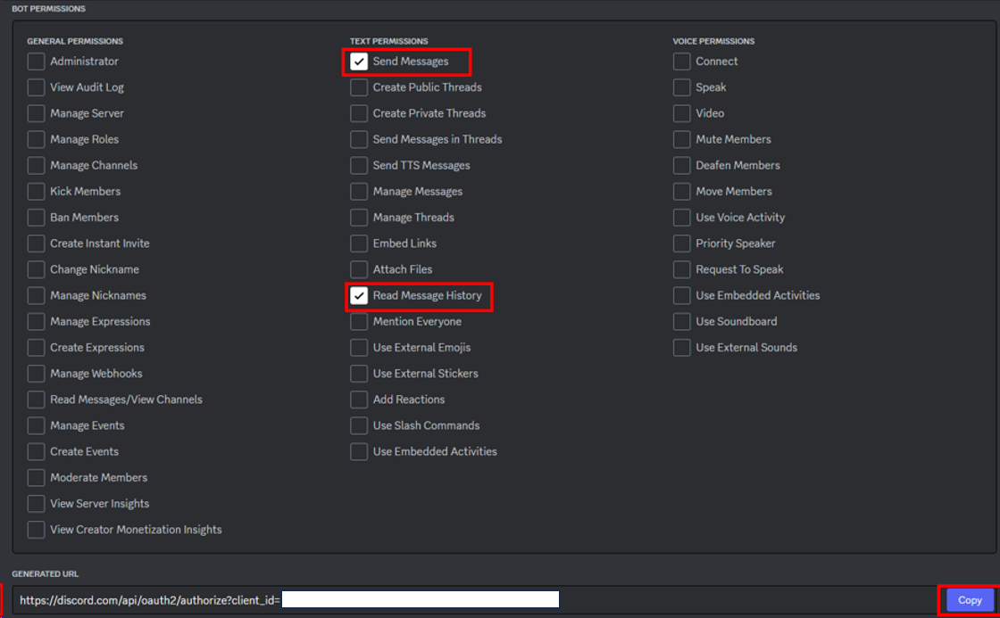
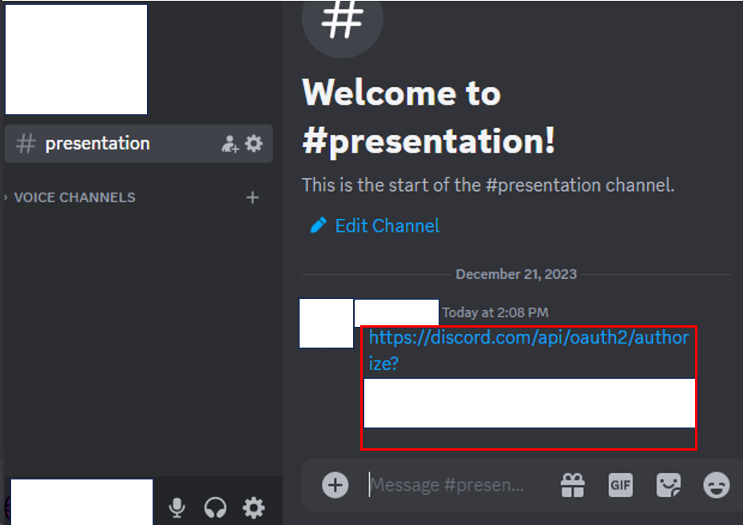
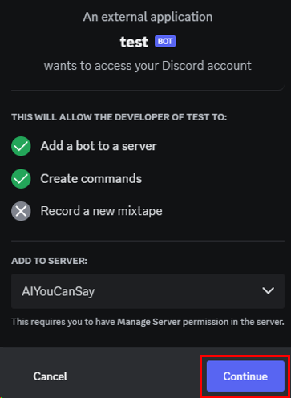
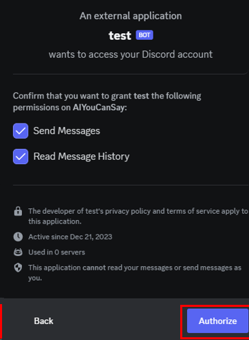
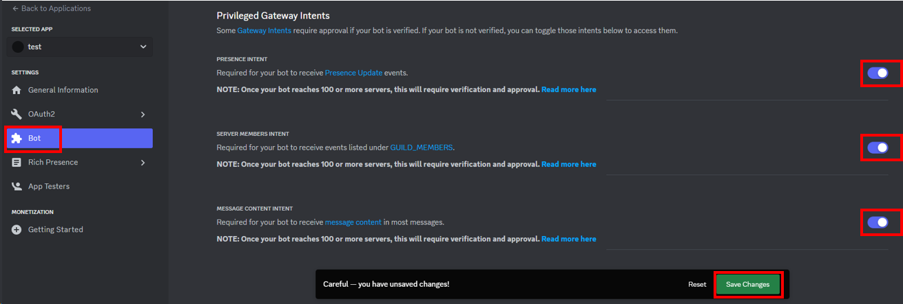
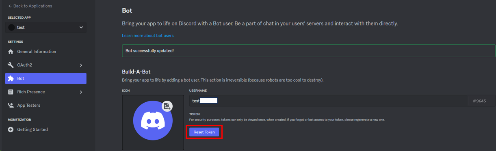

# How to create a Discord bot?

1. log in to [Discord Developer Portal](https://discord.com/developers/applications)

2. click **New Application** button

3. name the new bot, agree the policy, and click **Create** button

4. go to **OAuth2 -> URL Generator**, select **bot** in **SCOPES** menu

5. select **Send Messages** and **Read Message History** in **BOT PERMISSIONS** menu

   click **Copy** button, and get the link of new bot
   
        You can change it according to your purpose, here we create a chatting bot.
   
        You can also edit the permission scope once you introduce the bot into Discord.

6. go to Discord, select server and channel into which you want to introduce the bot

   paste the bot link and send the message into a channel, then click this link

7. authorize the new bot, and you will see it in the member list

 

8. go back to [Discord Developer Portal](https://discord.com/developers/applications)

   go to **Bot**, under **Privileged Gateway Intents** menu, activate all intents, and **Save Changes**

9. if you want to use it as a developer, you need bot TOKEN

   go to **Bot**, under **Build-A-Bot** menu, click **Reset Token** button, and copy the new token

