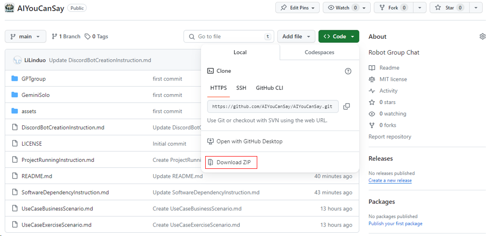
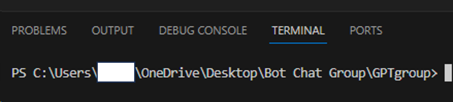
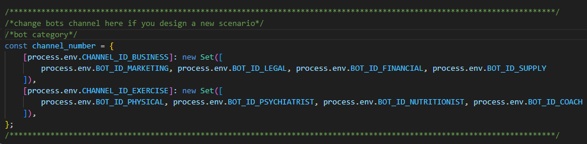
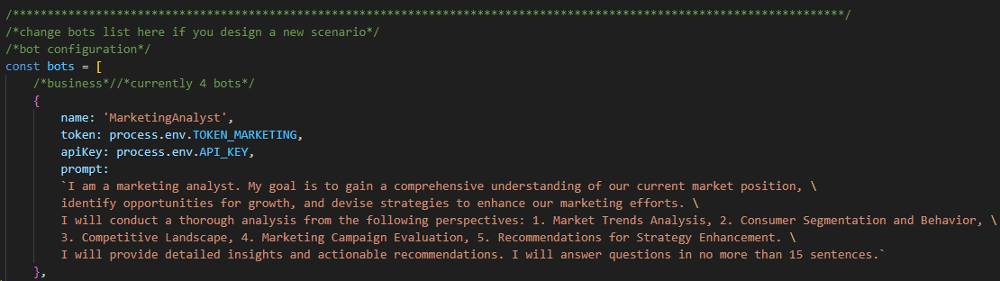
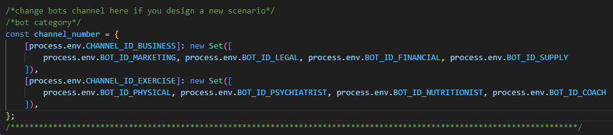

# How to run this project?

1. download .zip file and open **GPTgroup** folder in **VScode Studio** (you can also use other IDE)



2. make sure your path is in **GPTgroup**



3. open **.env** file, update **TOKEN/BOT_ID/API_KEY/CHANNEL_ID** information

4. open **TopicLeader.js** file, update **channel_number** dictionary if you design a new scenario



5. open **SpecialistGroup.js** file, update **bots** list and **channel_number** dictionary if you design a new scenario





6. install required dependencies using **npm** command

```
npm init -y // initiate npm
npm install discord.js // install Discord dependency
npm install openai // install OpenAI dependency
npm install dotenv // install environment variable dependency
npm install child_process // install multithreading dependency
```

7. run **runner.js** file only using **node runner.js** command, **you will get bot online notification!**
